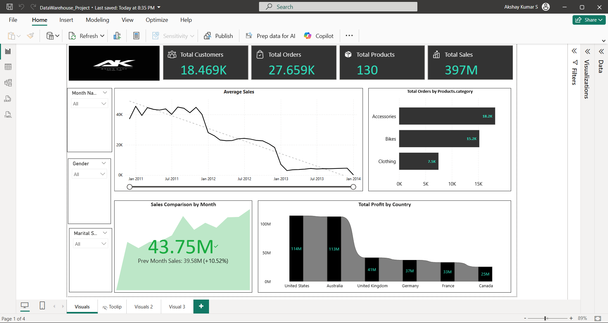
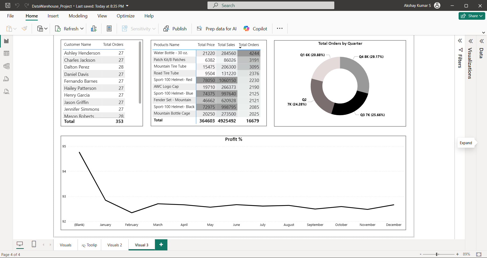

# 📊 ETL Data Warehouse & Power BI Reporting Project  

## 📌 Project Overview  
This project demonstrates the complete **ETL (Extract, Transform, Load)** workflow using **MS SQL Server** and showcases **interactive reporting & dashboards in Power BI**.  

The Complete ETL Process Project was done before. Here is the Report of that Process.
The goal was to design a **Data Warehouse**, perform ETL to transform raw data, and build **analytical dashboards** that answer key business questions using **Power BI, DAX, and Data Modeling**.  

---

## 🛠 Tools & Technologies  
- **SQL Server** → Data Warehouse design, ETL process (Stored Procedures, Joins, Aggregations).  
- **Power BI** → Data cleaning, DAX measures, modeling, and dashboard development.  
- **GitHub** → Version control & project hosting.  

---

## 📂 Project Workflow  

1. **Data Extraction**  
   - Collected raw transactional data from multiple sources.  

2. **Data Transformation (SQL)**  
   - Cleaned and standardized data.  
   - Applied business rules, joins, and aggregations.  
   - Designed a **Star Schema** (Fact & Dimension tables).  

3. **Data Loading (SQL Server)**  
   - Loaded transformed data into the **Data Warehouse**.  
   - Created indexes and optimized queries for reporting.  

4. **Data Modeling (Power BI)**  
   - Created a **separate Date Table** and linked it with fact tables using **relationships**.  
   - Implemented **calculated columns** and **feature engineering** (e.g., profit margins, customer categories).  

5. **Reporting (Power BI)**  
   - Built dashboards for Sales, Profitability, and Customer Insights.  
   - Created **KPIs & Trend Analysis** using **DAX measures** such as:  
     - **Previous Month Sales**  
       ```DAX
       Previous Month Sales = CALCULATE([Total Sales], DATEADD('Date Table'[Date], -1, MONTH))
       ```  
     - **Profit %**  
       ```DAX
       Profit % = DIVIDE([Profit], SUM('Sales Data'[Sales1]), 0) * 100
       ```  
   - Designed **interactive dashboards** with slicers and drill-through options.  

---

## 📸 Project Screenshots  

- **Sales Performance Dashboard**  
    

- **Profitability Dashboard**  
    

---

## 🎯 Key Learnings  
- Building a **Data Warehouse schema** and ETL pipelines.  
- Writing **SQL queries, stored procedures, and transformations**.  
- Designing **data models in Power BI** with Date Tables and relationships.  
- Creating **DAX measures for trend analysis & KPIs**.  
- Performing **feature engineering** by deriving new columns to enrich datasets.  
- Data storytelling: not just dashboards, but answering **“WHY” behind numbers**.  

---

## 🚀 How to Use This Project  
1. Clone this repository.  
2. Import SQL scripts into **MS SQL Server** to set up the Data Warehouse.  
3. Load sample data using the ETL scripts.  
4. Open the **Power BI file (.pbix)** to explore dashboards.  

---

## 📌 Author  
👤 **Akshay Kumar S**  
- Aspiring **Data Analyst** | SQL | Power BI | Python | Excel  
- [LinkedIn Profile](www.linkedin.com/in/akshay-kumar-212002ak)  
- 📧 akshaysubramanian064@gmail.com  
